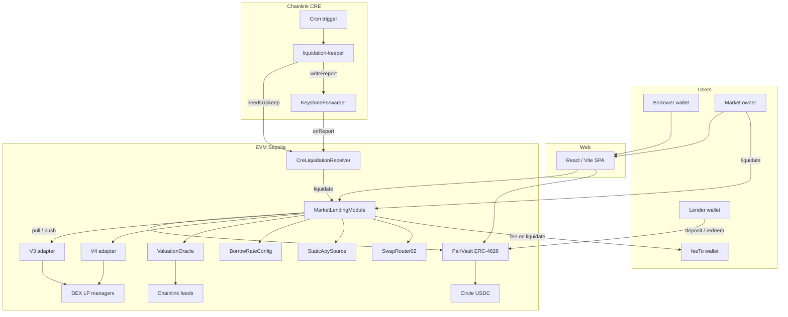

# LPFY Markets

Two-sided lending against **DEX LP NFTs**: lenders supply **Circle USDC** into **isolated per-pair ERC-4626 `PairVault`s**, borrowers post matching LP collateral and borrow under an LTV cap. Collateral is valued on-chain (DEX LP amounts × **Chainlink USD**). Liquidations unwind the NFT, swap non-USDC legs via **SwapRouter02**, repay the pair vault, take a protocol fee to **`feeTo`**, and send remaining surplus to the borrower — callable by the market admin or a **Chainlink CRE** keeper.

## Overview

| Surface | Role |
| ------- | ---- |
| **`smart-contracts/`** | Hardhat: `MarketLendingModule`, **PairVault (ERC-4626)**, adapters, oracle, CRE receiver |
| **`web/`** | Markets browse, vault supply/borrow, Assets; **Liquidate + Admin** for market owner only |
| **`cre/`** | Cron keeper → `needsUpkeep` → KeystoneForwarder → liquidate |
| **`docs/`** | Architecture HTML + setup guide |

**Debt asset (Sepolia):** [Circle Sepolia USDC](https://sepolia.etherscan.io/token/0x1c7D4B196Cb0C7B01d743Fbc6116a902379C7238) (6 decimals).

Addresses: [Sepolia markets deployment](smart-contracts/deployments/sepolia-markets.json) (full table at the bottom of this README).

> **Supply path:** lenders use **`PairVault.deposit` / `redeem`** (ERC-4626). Market `lendUsdc` / `withdrawLender` revert (`UsePairVault`).

## Features

### ERC-4626 PairVaults (lending)

- One **`PairVault` per pair** (USDC/WETH, USDC/USDT, USDC/WBTC) holds **idle USDC**.
- Lenders: standard ERC-4626 `deposit` / `mint` / `withdraw` / `redeem`.
- Borrow: market **`pullLiquidity`** from the vault → borrower.
- Repay / liquidation recovery: market **`pushLiquidity`** back into the vault.
- `totalAssets = idle vault USDC + principal + accrued interest` (share price rises with borrower interest).
- Withdrawals limited to **idle cash** (`maxWithdraw`).
- Utilization cap per pair (default **80%**).
- Per-pair **borrow APR** (`BorrowRateConfig`) and **lender display APY** (`StaticApySource` — UI only).

Deep dive: [Project Overview](docs/Project_Overview.pdf).

### Borrowing

- Deposit a **DEX LP NFT** as collateral (adapters hold the NFT).
- Borrow only from the pool matching the NFT’s underlying pair.
- Default **LTV 50%**; live valuation via DEX LP amounts × Chainlink feeds.
- Accrue interest, borrow more (within LTV), repay / `repayAndWithdraw`, withdraw NFT when debt is zero.

### Liquidation + fee structure

- Threshold default **65%** of collateral value (must be ≥ LTV).
- **Live globals**: `defaultLtvBps` / `defaultLiquidationThresholdBps` apply to all open loans.
- `previewLiquidation(loanId)` dry-run; `liquidate(loanId)` for owner or CRE only.
- Flow: unwind LP → SwapRouter02 → USDC → **push debt to PairVault** → protocol fee → borrower surplus.
- **Fee structure** (on `MarketLendingModule`):
  - `liquidationFeeBps` — % of **surplus** after vault is repaid (e.g. `1000` = **10%**)
  - `feeTo` — fee recipient (**independent of Ownable `owner`**)
  - Remainder of surplus → **borrower**; shortfall → no fee
  - Owner: `setLiquidationFeeBps` / `setFeeTo` (also set at redeploy via `LIQUIDATION_FEE_BPS` / `FEE_TO`)

### Chainlink CRE keeper

- `CreLiquidationReceiver` → KeystoneForwarder `onReport` → `liquidate`.
- CRE does not configure fees; fees are on the market.
- Local fallback: [local liquidation keeper script](smart-contracts/scripts/run-liquidation-keeper-local.js).

### Web

- Markets, pair detail (vault supply / borrow), Assets.
- **Liquidate** and **Admin** for market **owner** only.
- Wagmi / Viem; Sepolia network guard.

## Technology Stack

| Area | Technologies |
| ---- | ------------ |
| Smart contracts | Solidity `0.8.24`, Hardhat, OpenZeppelin `5.0.2` (ERC-4626), Ethers v6 |
| Debt / vaults | Circle USDC + per-pair `PairVault` |
| Valuation | DEX LP math, Chainlink AggregatorV3 |
| Swaps | SwapRouter02 |
| Automation | Chainlink CRE |
| Web | React 18, Vite 6, Wagmi 2, Viem 2, TypeScript |

## Project Architecture



### Where funds / NFTs live

| Asset | Custody |
| ----- | ------- |
| Idle Circle USDC (lender cash) | **`PairVault`** (per pair) |
| Outstanding principal + interest | Tracked on market; owed back to vault |
| DEX LP NFT (V3 / V4) | `V3Adapter` / `V4Adapter` |

### Liquidation path

```text
previewLiquidation(loanId)     → dry-run (anyone)
liquidate(loanId)              → owner or CRE only
  → Adapter.unwind             → empty NFT → borrower
  → SwapRouter02               → non-USDC → Circle USDC
  → pushLiquidity to PairVault → repay debt
  → feeTo                      ← liquidationFeeBps of surplus
  → borrower                   ← remaining surplus
```

## Project Structure

```text
.
├── README.md
├── smart-contracts/                     # Hardhat package
│   ├── contracts/markets/
│   │   ├── MarketLendingModule.sol      # Loans, pull/push, feeTo, liquidationFeeBps
│   │   ├── PairVault.sol                # ERC-4626 idle USDC per pair
│   │   ├── CreLiquidationReceiver.sol
│   │   └── …
│   ├── scripts/                         # Deploy / redeploy (updates CRE + webEnv)
│   ├── deployments/sepolia-markets.json
│   └── package.json
├── web/                                 # React SPA (Vite)
├── cre/                                 # CRE liquidation-keeper
└── docs/
    ├── Project_Overview.pdf             # Vaults, fees, flows
    ├── Smart_Contract_Architecture.pdf
    ├── Chainlink_CRE.pdf
    └── SETUP_AND_DEPLOY.md
```

## Prerequisites

- **Node.js** 18+ (20+ recommended), **npm**
- Sepolia ETH + deployer key (never commit)
- Optional CRE: [CRE CLI](https://docs.chain.link/cre/getting-started/cli-installation), [Bun](https://bun.sh) ≥ 1.2.21

Full walkthrough: [Setup & Deploy guide](docs/SETUP_AND_DEPLOY.md).

## Installation

### 1. Smart contracts

```bash
cd smart-contracts
cp .env.example .env   # PRIVATE_KEY + RPCs
npm install
npx hardhat compile
```

### 2. Web app

```bash
cd web
npm install
```

### 3. CRE (optional)

```bash
cd cre/liquidation-keeper
bun install
```

## Environment Configuration

| App | Env file | Notes |
| --- | -------- | ----- |
| Hardhat | [smart-contracts/.env](smart-contracts/.env.example) | `PRIVATE_KEY`, RPCs; optional `LIQUIDATION_FEE_BPS`, `FEE_TO`, `FUND_PER_PAIR` |
| Web | [web/.env](web/.env.example) | Paste `webEnv` from deployments JSON (includes `VITE_SEPOLIA_VAULT_*`) |
| CRE | [cre/.env](cre/.env.example) | `CRE_ETH_PRIVATE_KEY`, `SEPOLIA_RPC_URL` → `node cre/sync-rpc.js` |

### Web env (example — always prefer latest `webEnv`)

```env
VITE_NETWORK=sepolia
VITE_SEPOLIA_MARKET_MODULE=0x658A244Ad0c51F0C49d1fF79678bc642365b6E65
VITE_SEPOLIA_CRE_RECEIVER=0xc9682A8649B7587e43a9cb85068d23081C5397F7
VITE_SEPOLIA_USDC=0x1c7D4B196Cb0C7B01d743Fbc6116a902379C7238
VITE_SEPOLIA_VAULT_USDC_WETH=0x9478AD78af6C7758ADf8Aa78C2cc5ADEd5990843
VITE_SEPOLIA_VAULT_USDC_USDT=0xCE934C71ed024Da403fB68EC4C9e26C996d7E7ca
VITE_SEPOLIA_VAULT_USDC_WBTC=0xab30B8fEBEAdf0B2094Db087Df3CA4E632e27Ca0
# …plus oracle, adapters, rates, APY, USDT, WBTC — or run: npm run sync:addresses
```

## Running

```bash
# Web
cd web && npm run dev

# Compile / test
cd smart-contracts
npx hardhat compile
npx hardhat test

# Redeploy / full deploy
cd smart-contracts
npm run deploy:sepolia          # all contracts from scratch (hackathon)
# npm run redeploy:sepolia      # market+vaults only (reuse oracle/rates/APY)
npm run verify:sepolia
```

Then run `npm run sync:addresses` (from `smart-contracts/`) to refresh `web/.env` + README examples.

## User Flows

### Lender

1. Open a market pair → Supply.
2. Approve **Circle USDC** → **`PairVault.deposit`** (not `lendUsdc`).
3. Track vault shares on **Assets**.
4. Withdraw / redeem when the vault has **idle** cash.

### Borrower

1. Matching pair → Borrow → approve NFT → `borrowWithCollateral`.
2. Manage on **Assets** (`repay`, `repayAndWithdraw`, borrow more).

### Liquidation

1. Market **owner** → **Liquidate** (or CRE `--broadcast`).
2. After success: vault repaid → **`feeTo`** gets fee share → borrower gets rest.

## Smart Contracts (markets)

| Contract | Responsibility |
| -------- | -------------- |
| `PairVault` | ERC-4626 idle USDC; share price includes assets owed |
| `MarketLendingModule` | Loans, LTV, pull/push, **`feeTo` / `liquidationFeeBps`**, liquidate |
| `V3Adapter` / `V4Adapter` | DEX LP NFT custody + unwind |
| `ValuationOracle` | Position USD |
| `BorrowRateConfig` | Borrow APR |
| `StaticApySource` | Lender display APY |
| `CreLiquidationReceiver` | CRE → `liquidate` |

| Param | Default |
| ----- | ------- |
| `defaultLtvBps` | 5000 (50%) |
| `defaultLiquidationThresholdBps` | 6500 (65%) |
| `liquidationSlippageBps` | 100 (1%) |
| `maxUtilizationBps` | 8000 (80%) |
| `liquidationFeeBps` | set at deploy / via `setLiquidationFeeBps` (e.g. 1000 = 10%) |

## Chainlink CRE

```bash
cd cre
cre workflow simulate liquidation-keeper --non-interactive --trigger-index 0 --target staging-settings
cre workflow simulate liquidation-keeper --non-interactive --trigger-index 0 --target staging-settings --broadcast
```

See [CRE README](cre/README.md).

## Security Considerations

- Never commit `.env` / private keys.
- Liquidation is **restricted** (owner + CRE).
- Fees go to **`feeTo`**, not necessarily the owner — set carefully.
- Oracle freshness depends on Chainlink feeds.
- **Not audited** — experimental on public networks.

## Related Docs

- [Project Overview](docs/Project_Overview.pdf) — **vaults + fee model**
- [Setup & Deploy guide](docs/SETUP_AND_DEPLOY.md)
- [Contract Architecture](docs/Smart_Contract_Architecture.pdf)
- [Chainlink & CRE](docs/Chainlink_CRE.pdf)
- [Smart contracts README](smart-contracts/README.md)
- [Markets contracts notes](smart-contracts/contracts/markets/README.md)
- [Web README](web/README.md)
- [CRE README](cre/README.md)
- [Docs index](docs/README.md)

## Deployed contracts (Sepolia)

Canonical file: [Sepolia markets deployment](smart-contracts/deployments/sepolia-markets.json). Setup: [Setup & Deploy guide](docs/SETUP_AND_DEPLOY.md).

| Key | Meaning |
| --- | ------- |
| `contracts.marketLendingModule` | Market (borrow / liquidate / fees) |
| `contracts.pairVaults` / `pairVaults` | Per-pair ERC-4626 vaults |
| `contracts.creLiquidationReceiver` | CRE consumer |
| `contracts.debtAsset` | Circle USDC |
| `webEnv` | Ready-to-paste Vite vars (incl. vaults) |

| Contract | Address |
| -------- | ------- |
| MarketLendingModule | `0x658A244Ad0c51F0C49d1fF79678bc642365b6E65` |
| ValuationOracle | `0xA659A2C34c5E9026f7777AF654d0F742f8444f7F` |
| V3Adapter | `0x8Aafb1e3941E9b5f6b947e6213ab6Bf397845768` |
| V4Adapter | `0x33234ac1508034A9494baa3d82D055a6b1ae92Bd` |
| BorrowRateConfig | `0xb2e0c7b38b7DECE87A4E3D41A465F0175Ff65d25` |
| StaticApySource | `0x2b0B69EB316BCBaCc7167Dc1764637a7eBD296C2` |
| CreLiquidationReceiver | `0xc9682A8649B7587e43a9cb85068d23081C5397F7` |
| PairVault USDC/WETH | `0x9478AD78af6C7758ADf8Aa78C2cc5ADEd5990843` |
| PairVault USDC/USDT | `0xCE934C71ed024Da403fB68EC4C9e26C996d7E7ca` |
| PairVault USDC/WBTC | `0xab30B8fEBEAdf0B2094Db087Df3CA4E632e27Ca0` |

## License

See repository license file if present; otherwise all rights reserved by the project owners unless otherwise stated.
